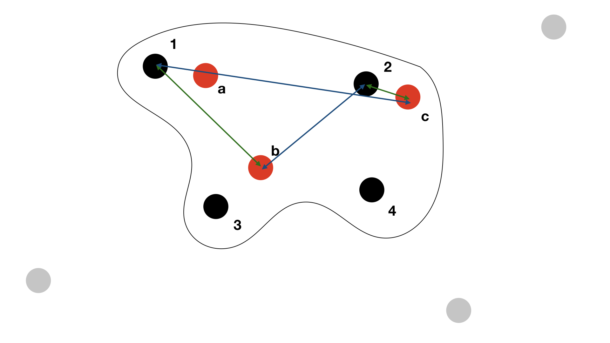
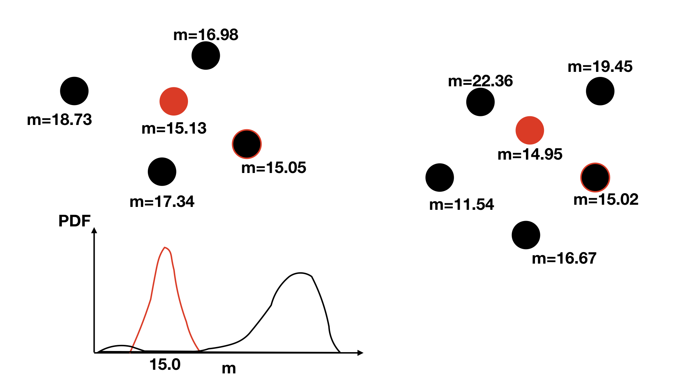
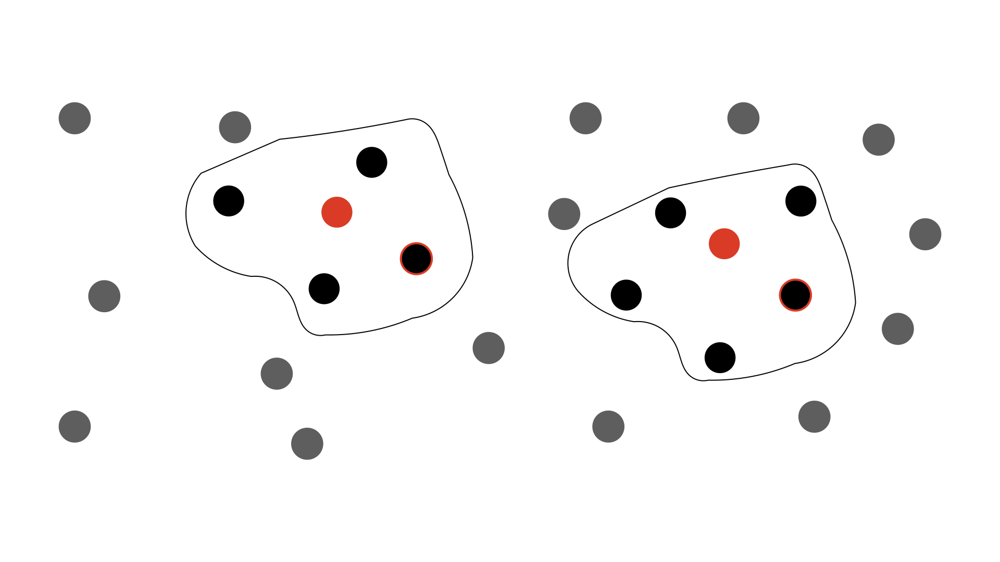

******************
macauff Algorithms
******************

macauff is a full probabilistic, Bayesian cross-match package. On this page you will find some of the details of the implementation, both mathematically and computationally.

Jump to:

- `Matching Overview`_

- `The Astrometric Uncertainty Function`_
- `Photometric Likelihood`_

- `AUF Component Computation`_
- `Island Group Creation Computation`_
- photometric likelihood implementation
- best island permutation

Matching Overview
=================

Following Wilson & Naylor (2018a, MNRAS, 473, 5570)'s "one-match" equations -- the case where sources in catalogue ":math:`\gamma`" are matched to multiple competing catalogue ":math:`\phi`" objects, but there is at most one common detection between the two datasets -- we have

.. math::

	P(H_a|D) = \frac{N_\mathrm{c}G^{kl}_{\gamma\phi}c^{kl}_{\gamma\phi}\prod\limits_{i \neq k}\,N_\gamma f_\gamma^i\prod\limits_{j \neq l}N_\phi f_\phi^j}{\prod\limits_i\,N_\gamma f_\gamma^i\prod\limits_jN_\phi f_\phi^j + \sum\limits_s\,\sum\limits_t\,N_\mathrm{c}G^{st}_{\gamma\phi}c^{st}_{\gamma\phi}\prod\limits_{i \neq s}\,N_\gamma f_\gamma^i\prod\limits_{j \neq t}N_\phi f_\phi^j}

where :math:`N_\mathrm{c}`, :math:`N_\gamma`, and :math:`N_\phi` are the densities of matches between the two catalogues and of non-matches in the two catalogues respectively; :math:`G^{kl}_{\gamma\phi} \equiv G(\Delta x_{kl}, \Delta y_{kl})` is the probability of two sources having some given on-sky separation under the hypothesis that they are counterparts; and :math:`c^{kl}_{\gamma\phi} \equiv c(m_k, m_l)` and :math:`f_\gamma^i \equiv f_\gamma(m_i)` are the joint probability of counterparts having their respective magnitudes in the two catalogues and of a non-match having its particular magnitude in its given catalogue. Here we iterate over :math:`s` and :math:`t` as the single common match between the two catalogues (:math:`s` over catalogue :math:`\gamma` and :math:`t` over :math:`\phi`) and :math:`i` and :math:`j` as the remaining non-matches in the two catalogues. Additionally, we have the potential case where there are no counterparts instead of one unknown pairing:

.. math::

	P(H_0|D) = \frac{\prod\limits_i\,N_\gamma f_\gamma^i\prod\limits_jN_\phi f_\phi^j}{\prod\limits_i\,N_\gamma f_\gamma^i\prod\limits_jN_\phi f_\phi^j + \sum\limits_s\,\sum\limits_t\,N_\mathrm{c}G^{st}_{\gamma\phi}c^{st}_{\gamma\phi}\prod\limits_{i \neq s}\,N_\gamma f_\gamma^i\prod\limits_{j \neq t}N_\phi f_\phi^j}

These forms can then be generalised to allow for more than one common match (Wilson & Naylor 2018a, equations 26-27):

.. math::

	P(\zeta, \lambda, k|\gamma, \phi) = \frac{1}{K}\times\!\!\!\!\!\!\prod_{\delta\not\in\zeta\cap\delta\in\gamma}\!\!\!\!\!\!\!N_\gamma f_\gamma^\delta\!\!\!\!\!\!\prod_{\omega\not\in\lambda\cap\omega\in\phi}\!\!\!\!\!\!N_\phi f_\phi^\omega\prod\limits_{i=1}^kN_\mathrm{c}G^{\zeta_i\lambda_i}_{\gamma\phi}c^{\zeta_i\lambda_i}_{\gamma\phi},

	K = \!\!\!\!\!\!\!\!\sum_{k=0}^{\min(n_\gamma, n_\phi)}\!\!\!\!\!\sum_{\zeta\in\Gamma_k}\sum_{\lambda\in\Phi_k}\prod_{\delta\not\in\zeta\cap\delta\in\gamma}\!\!\!\!\!N_\gamma f_\gamma^\delta\!\!\!\!\!\!\prod_{\omega\not\in\lambda\cap\omega\in\phi}\!\!\!\!\!\!N_\phi f_\phi^\omega\prod\limits_{i=1}^kN_\mathrm{c}G^{\zeta_i\lambda_i}_{\gamma\phi}c^{\zeta_i\lambda_i}_{\gamma\phi}

where :math:`K` is the normalisation constant -- the evidence in the Bayesian framework -- for the total number of permutations to consider between a particular set of sources in the two catalogues that may be potential counterparts to one another. :math:`k` is the number of common matches (:math:`k=0` then corresponds to hypothesis :math:`H_0` above, of no common matches); :math:`\zeta` is a particular :math:`k`-length sub-set of the total sources being considered potential matches in catalogue :math:`\phi`, with :math:`\lambda` the sub-set of potential matches from catalogue :math:`\phi`.

Thus after we create a small "universe" of objects on the sky that cannot be *eliminated* as potential counterparts to one another (splitting our large catalogue of objects into many smaller, independent sets of sources; see "island creation" below) between the two catalogues we iterate, first over the number of in-common matches (:math:`k`), then for a given number of common matches (:math:`k=2`, for example) over which objects in the two catalogues are "matches" and which are "non-matches" -- systematically, without any prior ruling on what may or may not be a "good" match to the other dataset -- and then finally over which example pairing of the sources we have. For example, if :math:`\gamma = \{1, 2, 3, 4\}` and :math:`\phi = \{a, b, c\}` for :math:`k = 2` we could have :math:`\zeta = \{1, 2\}` and :math:`\lambda = \{b, c\}` for which we need to consider :math:`1` and :math:`b` matching and :math:`2` and :math:`c` matching, as well as :math:`1-c` and :math:`2-b` matches. This example is shown below.

h, 3 and b should match, with object 4 having no counterpart, but in our example the separations between objects are large and the matches would be considered poor.

These equations are quite compact and hide a significant amount of computation to derive terms :math:`N`, :math:`G`, :math:`c`, and :math:`f`; these are expanded upon below.

The Astrometric Uncertainty Function
====================================

The key algorithmic extension of macauff is its generalisation of what Wilson & Naylor (2017, MNRAS, 469, 2517) called the AUF. This is the general belief in an astronomical object's true position given its detected position. The most fundamental contribution to the AUF is the uncertainty in position due to noise in an astronomical image and the effect this has on any centroid metrics used to determine the position of a source in the image.

Wilson & Naylor (2018a) then showed that the probability of two objects (one per catalogue being matched) having some given on-sky separation under the hypothesis that they are counterparts to one another -- two detections of the same astrophysical object -- is the convolution of their respective AUFs -- mathematically given by :math:`G = h_\gamma * h_\phi`. This is frequently quoted in literature for the case where noise-based centroid uncertainties are the only term considered, as these are Gaussian in nature and hence the convolution easy to compute (being a Gaussian with variance the sum of the individual objects' variances).

However, Wilson & Naylor (2017) showed that for crowded datasets -- in terms of number of sources per PSF below the object in consideration's magnitude -- there is an additional term that ought to be considered: that of the effect of hidden unresolved contaminant objects and their "tugging" on the centre-of-light of the (now composite) system during the centroid determination stage of a catalogue creation.

The specifics of how this is determined are expanded upon below, but the key is that this is simply an additional term within the AUF, and hence we have :math:`h_\mathrm{\gamma} = h_{\gamma, \mathrm{centroid}} * h_{\gamma, \mathrm{perturbations}}`. Each individual object has its certainty of its position reduced slightly by the unknown (but statistically quantifiable) effect of whether it has one (or multiple) unresolved faint objects within its point spread function, further moving its detected position away from its "true" location on the sky.

Photometric Likelihood
======================

The other extension macauff includes over other cross-matching algorithms is the data-driven, symmetric consideration of the probability of objects being counterparts to one another or not based on their photometry. Here the idea put forward by Wilson & Naylor (2018a) is one of positive and negative reinforcement: if we were matching two datasets with observations taken in the same filter then we'd expect matches to be objects with the same brightness (scatter in measurements due to uncertainty in the detection notwithstanding); therefore, if we look within a few arcseconds of each object of a particular magnitude in one catalogue at the brightnesses of objects in the opposing catalogue we'd see a *consistent* set of objects of that same brightness, plus (unique to each source) a random scattering of other brightnesses (usually fainter, due to the larger number of faint objects). We can use these correlations and lack of correlations between magnitudes across the two catalogues to build a set of probabilities of match and non-match based on the photometry of the ensemble datasets. An example schematic highlighting this is shown below.

nesses of all coeval sources. Each source has a separate 15th magnitude object near to it, while each has a unique set of random other brightnesses. A schematic probability density function graph shows this building to a tight set of counterpart magnitudes and a broad distribution of non-counterpart magnitudes, distinguishing matches and non-matches on brightness alone.

Here we can build the "field" star distribution -- as Wilson & Naylor (2018a) refer to it, meaning the non-match distribution -- :math:`f` simply by considering the magnitude distributions of objects nowhere near to objects in a particular catalogue. In the below schematic, if we remove all of the black circles within the enclosed lines around the red objects, we can calculate a distribution of the brightnesses of all remaining objects -- doing the same for the opposing case, to build the distribution of non-matched "red" sources.

of magnitudes, then the leftover objects form our non-match brightness distribution, being those sources which cannot possibly be a potential counterpart in the other catalogue.

This is possible since we should be able to make the assumption that the distribution of the magnitudes of objects on the sky is not correlated -- i.e., the distribution of brightnesses of the non-matches within the enclosed regions in the above schematic is not, on large enough scales, any different from the distribution of magnitudes of sources outside of those regions. If this is *not* possible for some reason, use of photometric likelihoods with macauff should be avoided.

To calculate the match distributions :math:`c` seems like it should be as easy as subtracting the distribution of non-match magnitudes from the distribution of magnitudes within the previous enclosed regions. If the non-match distributions are statistically the same, we'd expect that we should end up with something like (counterparts + field stars) - field stars = counterparts. However, as we saw above with the AUF, there is a catch: the point spread function of the telescope renders objects two-dimensional on astronomical images, and therefore faint objects are systematically hidden. Astrometrically they then have an effect on the measured positions, but this also means we would systematically *over* subtract our clean sample of "field" objects when attempting to separate out counterparts and non-matches from the nearby objects.

Therefore, in a given small magnitude range -- say :math:`14.95 \leq m_\gamma \leq 15.05` -- we consider the "field" star (non-match) distribution :math:`f` and the *brightest* star distribution :math:`b`, since :math:`b` is a density-independent argument. Following Naylor et al. (2013, ApJS, 209, 30) we therefore find

.. math::

	Z_{c\gamma}\cdot c_\gamma(m_\phi|m_\gamma) = Z_\gamma b_\gamma(m_\phi|m_\gamma)\exp{\left(A_\gamma N_\phi F_\phi(m_\phi)\right)} - \left(1 - Z_{c\gamma} C_\gamma(m_\phi|m_\gamma)\right)A_\gamma N_\phi f_\phi(m_\phi)

where :math:`Z_c` is the fraction of sources in the small magnitude range with counterparts inside a certain on-sky distance; :math:`Z` is the fraction of sources in the magnitude slice with at least one source in its radius; :math:`A` is the area within the specified radial distance; :math:`N_\phi` is the density of non-matched sources in the catalogue; and :math:`C` and :math:`F` are the integrals of :math:`c` and :math:`f` from :math:`-\infty` to :math:`m`.

After this is calculated, we are left with :math:`c(m_\phi | m_\gamma)`, which we can turn into a joint probability on magnitude -- :math:`c(m, m)` -- by applying conditional probability, giving :math:`c(m_\gamma, m_\phi) = c_\gamma(m_\phi|m_\gamma) \cdot p_\gamma(m_\gamma)` where :math:`p_\gamma(m_\gamma)` is simply the probability density function describing the magnitude distribution of the entire catalogue :math:`\gamma`.

AUF Component Computation
=========================

Perturbation Due to Contaminant Object
--------------------------------------

To compute the effects of unresolved, blended contaminant objects we follow the methodology laid out by Wilson & Naylor (2018b, MNRAS, 481, 2148). In summary, for a particular object (described by its central magnitude and local object density) we simulate multiple realisations of the potential blended objects, compute the perturbation "tug" due to these objects, and combine all realisations.

To achieve this, we simulate galaxy counts through a Schechter function approximation (Wilson, 2022, RNAAS, 6, 60), and use the TRILEGAL simulations (Girardi et al., 2005, A&A, 436, 895) to realise a set of star counts for the particular line of sight in the Galaxy. Combining these, we then have a histogram of objects :math:`D` -- sources per square degree per unit magnitude -- and the overal density of objects (sources per square degree) down to some specified magnitude, :math:`N_\mathrm{TRI}`.

Then, starting at the central object brightness, we step through from :math:`m` to :math:`m + \Delta m_\mathrm{max}` in steps of :math:`\mathrm{d}m` -- something like 0.1 magnitudes -- and calculate how many objects we would expect to be within a "PSF" approximated by a circle of some radius :math:`R` -- generally considering at minimum a Rayleigh Criterion for deblending point sources. This is a numerical calculation, given by

.. math::

	P_B(m + \Delta m) = \frac{N_\mathrm{empirical}}{N_\mathrm{TRI}}D(m + \Delta m) \times \pi R^2 \times \mathrm{d}m

with :math:`N_\mathrm{empirical}` being the number of sources per square degree above a given magnitude in the *dataset*. For this particular simulation we then draw a realised number of objects :math:`k` with magnitude :math:`m + \Delta m` from a Poissonian distribution with :math:`\lambda = P_B`, randomise the fluxes within :math:`m + \Delta m` to :math:`m + \Delta m + \mathrm{d}m`, and place the object(s) -- if more than none are drawn -- randomly within a circle of radius :math:`R` (uniformly with angle :math:`0 \leq \theta < 2\pi`, uniformly in :math:`r^2` space to account for the additional :math:`r` term in the unit area of a circle, :math:`0 \leq r \leq R`). This is iterated across all magnitude bins from zero to :math:`\Delta m_\mathrm{max}`.

Once all sources for this given PSF are realised and placed within the circle, their effect on the central object is calculated; within macauff we have two options for calculating this effect, which we detail below. No matter how we calculate these offsets, though, once we have run this loop a given number of times we can calculate a PDF of the distribution of radial perturbations from all realisations. These realisations can equivalently thought of as a simulation of a patch of sky, distributing different brightness objects according to their specific densities, and then randomly placing additional "central" source circles within which objects are measured and their perturbation effects computed.

This distribution of offsets then forms :math:`h_\mathrm{perturbations}` to be convolved with :math:`h_\mathrm{centroid}`. Computationally we achieve this by using a Hankel (Fourier-Bessell) transformation reducing a two-dimensional convolution to a one-dimensional problem, and taking advantage of the fact that a convolution in real-space is equivalent to a multiplication in Fourier-space, so we calculate :math:`f * g` as :math:`\mathcal{H}^{-1}(\mathcal{H}(f) \times \mathcal{H}(g))`, where :math:`\mathcal{H}` is a Hankel transformation and :math:`\mathcal{H}^{-1}` is an inverse Hankel transformation.

The Hankel transformation is given by

.. math::

	[\mathcal{H}(f)](\rho) = 2\pi\,\int\limits_0^\infty\!r f(r) J_0(2\pi r \rho)\,\mathrm{d}r

with the inverse Hankel transformation symmetrically defined

.. math::

	[\mathcal{H}^{-1}(f)](r) = 2\pi\,\int\limits_0^\infty\!\rho f(\rho) J_0(2\pi r \rho)\,\mathrm{d}\rho.

Note that this use of a *Hankel* transformation, instead of a more general two-dimensional *Fourier* transformation, implicitly requires circular symmetry, and hence a singular astrometric centroid uncertainty :math:`\sigma`. Therefore we require that the two catalogues being matched have reasonably circular covariance matrices that can approximate to a singular value for uncertainty, and if your dataset does not met this requirement you should consider whether the need to describe the centroid uncertainty completely is more important than the secondary effect of unresolved contaminant objects in that particular dataset.

If we have a sufficiently resolved array of perturbation AUF component offsets we can combine it with the noise-based centroid determination component of position uncertainty, analytically transforming a Gaussian to its Fourier-space representation as :math:`exp(-2 \pi^2 \rho^2 \sigma^2)` and creating an array of values on the same :math:`\rho` grid, and perform Hankel and inverse-Hankel transformations. First, convert the perturbation component to Fourier-space:

.. math::

	[\mathcal{H}(f)](\rho_i) = 2\pi\,\sum_j r_j f_j J_0(2\pi r_j \rho_i) \times \mathrm{d}r_j

and then subsequently invert the Fourier-space representations back to real space:

.. math::

	[\mathcal{H}^{-1}(g)](r_i) = 2\pi\,\sum_j \rho_j g_j J_0(2\pi r_i \rho_j) \times \mathrm{d}\rho_j

where :math:`g = [\mathcal{H}(f)](\rho) \times exp(-2 \pi^2 \rho^2 \sigma^2)`. In practice since we then go a step further and convolve the two AUFs together, what we actually end up doing in e.g. the final "counterpart pairing" step is define :math:`g = [\mathcal{H}(f_\gamma)](\rho) \times [\mathcal{H}(f_\phi)](\rho) \times exp(-2 \pi^2 \rho^2 \sigma_\gamma^2) \times exp(-2 \pi^2 \rho^2 \sigma_\phi^2)`, convolving (multiplying the Fourier-space representations of) the two centroid, noise-based Gaussian distributions and the two distributions of perturbations due to unresolved contaminants, one per catalogue, simulated separately.

One of the key steps in this process is the determination of the "centre-of-light" perturbation due to the simulated blended contaminants within a particular PSF simulation realisation. macauff has two ways it currently handles these: the first, and the one detailed by Wilson & Naylor (2018b), is effectively the behaviour of the centre-of-light in aperture photometry, or in the limit of infinite signal-to-noise ratio (SNR), in which we simply take a flux-weighted average of all positions within the PSF, including the central object (with relative flux of one, and position at the origin). The second method, based on Plewa & Sari (2018, MNRAS, 476, 4372), is the opposite case: this handles the background sky dominated, PSF photometry regime, determining the least-squares minimisation of fitting two Gaussians (approximations of a PSF) with some offset with just a single PSF Gaussian. These two regimes are valid at very large and very small SNRs respectively; in the intermediate SNR regime the two versions of the AUF are calculated and a weighted average is taken using the SNR as a proxy for the weight to apply to each method.

Finally, we require :math:`N_\mathrm{empirical}`, the source density on the sky around each individual object, since we need to calculate the AUF on a grid of magnitudes and local normalising densities. Here we simply take a sum of all objects within some given radius and below the cut-off magnitude, and divide by the area :math:`\pi R^2`, accounting for the loss of area if sufficiently close to the edge of the cross-match region as defined.

Island Group Creation Computation
=================================

The second stage of performing cross-matches with macauff is the creation of "islands" of potentially coeval counterparts, from which true matches are determined and counterpart assignment performed. Considering the example schematic within the `Matching Overview`_ section, one example of an "island" of sources is shown -- but surrounding it there are extra islands. Instead of considering all match and non-match permutations simultaneously, as this is tremendously computationall expensive, we split sources up into those that overlap one another in the sky, cutting the complexity of the problem by separating out those objects that are definitely not matchs to one another into independent sub-sets of the main catalogue. At the same time, we will see that if we include photometric likelihoods we need to know whether particular sources are within a certain fraction of their cumulative probability of one another based on their respective AUFs.

The primary question we have in determining sub-catalogue islands is "are these two objects beyond some given critical astrometric separation?" -- this question can either be in pure sky separation or some cumulative AUF-convolution percentage. Hence the initial step of the "group sources" stage is to determine potential counterpart pairings between our two catalogues based on both being within some absolute sky separation and within a given cumulative probability of separation if the objects were counterparts with their respective AUFs. The absolute sky separation is set for the entire catalogue, so should be sufficiently large to accommodate all sources and their uncertainties, but should not be too large such that all sources end up considered in one giant island together; for *Gaia*-*WISE* something like 10 arcseconds is a good starting separation. These "overlaps" are considered on a relatively "brute force" computational basis -- small regions of sky are loaded into memory and all pairings are considered, first being eliminated on absolute sky separation and then through integrations of the AUF convolutions out to the specified radial separation. These can be achieved reasonably computationally efficiently by considering the integral of

.. math::

	\int\limits_0^{2\pi}\int\limits_0^{r}\! r{'}\,[\mathcal{H}^{-1}(g(\rho))](r{'})\,\mathrm{d}r{'}\,\mathrm{d}\theta

where :math:`g = [\mathcal{H}(f_\gamma)](\rho) \times [\mathcal{H}(f_\phi)](\rho) \times exp(-2 \pi^2 \rho^2 \sigma_\gamma^2) \times exp(-2 \pi^2 \rho^2 \sigma_\phi^2)` as defined previously -- that is, :math:`g` is the multiplication of all four Fourier-space components of the two AUFs -- and :math:`\mathcal{H}^{-1}` is the inverse-Hankel transformation. If we expand the inverse-Hankel transformation, rearrange and simplify we get

.. math::

	\int\limits_0^{2\pi}\int\limits_0^{r}\! r{'}\,[\mathcal{H}^{-1}(g(\rho))](r{'})\,\mathrm{d}r{'}\,\mathrm{d}\theta =
	2\pi\,\int\limits_0^{r}\! r{'}\,2\pi\,\int\limits_0^\infty\!\rho g(\rho) J_0(2\pi r{'} \rho)\,\mathrm{d}\rho \,\mathrm{d}r{'} =

.. math::

	[2\pi]^2\,\int\limits_0^\infty\!\rho g(\rho)\,\int\limits_0^{r}\!r{'}\,J_0(2\pi r{'} \rho)\,\mathrm{d}r{'}\,\mathrm{d}\rho = [2\pi]^2\,\int\limits_0^\infty\!\rho f(\rho)\,\frac{r\,J_1(2\pi r \rho)}{2 \pi \rho}\,\mathrm{d}\rho =

.. math::

	2 \pi\,r\,\int\limits_0^\infty\!g(\rho)\,J_1(2\pi r \rho)\,\mathrm{d}\rho.

Hence the *four*-dimensional integral still reduces to a one-dimensional integral if we can consider circular symmetry. Computationally we perform

.. math::

	2 \pi\,r\,\sum_i\!g(\rho_i)\,J_1(2\pi r \rho_i)\times\mathrm{d}\rho_i

as an approximation to the integral.