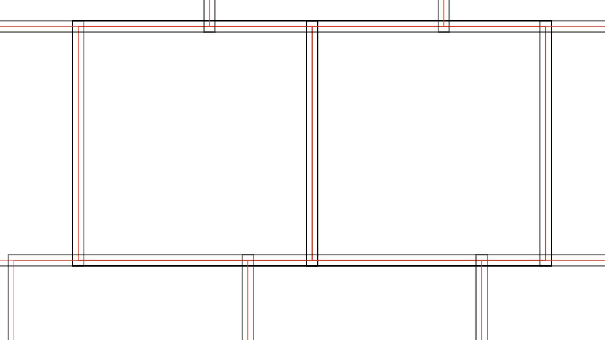

************************
Pre- and Post-Processing
************************

The main aspect of macauff is the process of determining most likely counterparts between two photometric catalogues through `~macauff.CrossMatch`. However there are several steps that must (or can/should be) performed before and after the call to the matching process.

Pre-processing is broken down into several steps: catalogues must always be converted from original form into binary ``.npy`` files, and optionally can have their centroid precisions updated if necessary during this process, and if necessary the parameterisation required for the background-dominated PSF photometry algorithm for use in the creation of perturbation AUF components should be derived. Post-processing is simply the creation of an output joined composite dataset from saved files created during the cross-match process.

Pre-Processing
==============

Create Input Files
------------------

The singular requirement for running macauff is that each photometric catalogue be distilled into three separate binary files: ``con_cat_astro.npy``, ``con_cat_photo.npy``, and ``magref.npy``. As shown in the :doc:`quickstart`, these have a set number of columns for each file, and should share the same number of rows. The layout should be as follows:

	| con_cat_astro.npy: shape (N, 3)
	|	coord1 - RA or Galactic longitude (degrees)
	|	coord2 - Dec or Galactic latitude (degrees)
	|	uncert - singular, circular astrometric uncertainty (arcseconds)

	| con_cat_photo.npy: shape (N, M)
	|	filter1 - magnitude in filter1
	|	filter2 - magnitude in filter2
	|	...

	| magref.npy: shape (N, 1) or (N,)
	|	best detection (0 to M-1) across filter1, filter2, ...

Starting from commonly available photometric catalogues such as the ones downloaded from the *Gaia* archive, the initial steps that must be performed are the creation of a single astrometric uncertainty and the determination of the "best" detection.

Singular astrometric uncertainty can be as simple as taking the average of the semi-major and semi-minor axes of the covariance ellipse. If the catalogue in question already reports covariance in the form of semi-major and semi-minor astrometric uncertainties along with their angle of rotation, simply take :math:`\sigma = 0.5 \times (\sigma_\mathrm{major}+\sigma_\mathrm{minor})`. On the other hand, if the catalogue reports the "full" covariance matrix, :math:`\sigma_\mathrm{RA}`, :math:`\sigma_\mathrm{Dec}`, and correlation :math:`\rho`, semi-major and semi-minor axes can be computed as

.. math::

	\sigma_\mathrm{major}^2 = \frac{1}{2}\left[\sigma_\mathrm{RA}^2 + \sigma_\mathrm{Dec}^2 + \sqrt{(\sigma_\mathrm{RA}^2 - \sigma_\mathrm{Dec}^2)^2 + 4(\rho\sigma_\mathrm{RA}\sigma_\mathrm{Dec})^2}\right]

.. math::

	\sigma_\mathrm{minor}^2 = \frac{1}{2}\left[\sigma_\mathrm{RA}^2 + \sigma_\mathrm{Dec}^2 - \sqrt{(\sigma_\mathrm{RA}^2 - \sigma_\mathrm{Dec}^2)^2 + 4(\rho\sigma_\mathrm{RA}\sigma_\mathrm{Dec})^2}\right]

and the average taken.

Determination of the "best" magnitude to use is left to the individual catalogue and the purpose for its use. However, some universal selection criteria likely apply. Removal of obvious artefacts, objects with signal-to-noise ratios (SNRs) of order unity, poor quality detections that e.g. do not pass a :math:`\chi^2` cut, and any objects failing any other sensible filtering criteria should be applied initially. Then, for each object, priority should be given to the highest quality detection in all available bandpasses (high SNR, not saturated, less contaminated, etc.). If multiple bands meet the criteria, a good rule of thumb is to use the wavelength closest to the other catalogue to be matched, as this will result in more discernment if the photometric likelihoods are used and better rejection of false matches -- in the limit that the same exact filters are used, true matches would follow :math:`x = y` (with some scatter from measurement uncertainty), but this becomes blurred across magnitude-magnitude space with increasing wavelength separation between bandpasses.

Once these new values -- singular astrometric precision and "best detection" index -- are computed, if they are available within a ``.csv`` file, the binary files macauff requires can be derived using `~macauff.csv_to_npy`.

The Core-Halo Chunk Model
^^^^^^^^^^^^^^^^^^^^^^^^^

While ``macauff`` can be used with a singular monolithic cross-match region, it can be preferable to split a large block of sky into smaller, more manageable sections to have counterparts assigned in an individual basis; the most obvious reason to do so is to parallelise these smaller regions to simultaneously cross-match through e.g. MPI distribution, as ``macauff`` offers.

To do so, you will need to define the particular size of both the *core* and *halo* of each region, as shown in the schematic below.

h halo area in another core square.

The cores are the red squares; these are defined such that they exactly touch one another with no source being in two cores. Halos, on the other hand, are padded regions around each core (i.e., slightly larger squares centered on the same sky coordinates as their respective core), shown as the black squares. This then means that each halo overlaps multiple different core regions, with each core having multiple overlapping halos.

These should be defined such that you provide, for each so-called "chunk", a region of *halo plus core* size, such that halos effectively contain superfluous matches. Taking into account that ``macauff``'s island creation "bins" any *islands* of sources that are within ``pos_corr_dist`` of the four coordinates defining the rectangle of the match region -- in this case, the *halo* region -- we then further remove any additional objects that are still matched, but come from another region's core.

To this end, the halo should be defined such that, even after removing the ``pos_corr_dist`` edge-of-region-adjacent sources, we are left with all matches that overlap the *core*. A reasonably safe bet is to set the halo size to twice ``pos_corr_dist``, but depending on the relative size of the core and this "unreliable island" region larger or smaller halo width regions may be required.

Update Astrometry Precisions
----------------------------

As a full Bayesian cross-match code, it is vital that all aspects of input data are accurately reflected in the catalogues matched with macauff. To this end it provides key additional components to the AUF, but must also rely on accurate and precise astrometric precisions for all sources, as this determines the most fundamental AUF component in the noise-based centroid uncertainty. Hence, within macauff ``AstrometricCorrections`` is provided to ensure that if necessary corrections can be made to these quoted values.

For numerous reasons, some photometric catalogues do not contain full uncertainties on the positions of each individual object. In some cases they may simply be smaller datasets that lack the processing power to derive such numbers; in others, the *statistical* precisions but not further full systematics may be provided. Either way, these uncertainties can be derived as an ensemble through distributions of separations to a second, well-understood catalogue. For a set of objects in a small range of magnitudes -- and hence, to first order, the same astrometric precision -- we can take a robust set of cross-matches to objects in a second dataset (ideally one with a much higher astrometric precision, such as *Gaia* or the Hubble Source Catalog) and, after accounting for any necessary additional AUF components (ensuring that all objects are from roughly the same normalising sky background density of sources), compute the best-fit astrometric precision for the ensemble of objects in question. Taking all of the additional AUF components and opposing catalogue object precision as fixed (or negligible), a least-squares minimisation that searches for the best-fit common astrometric precision for the objects in question -- as well as nuisance parameters such as false match fraction -- for multiple sets of objects in turn, we can then derive a series of "best fit" precisions and plot them as a function of "input" precision. Finally, we can then fit for a parameterisation of :math:`\sigma_\mathrm{best}(\sigma_\mathrm{input})`, assuming that the key components are any potential missing systematic uncertainty and a mis-matched scaling relation for the statistical component and hence approximating the scaling as :math:`\sigma_\mathrm{best} = \sqrt{n^2 + (m \sigma_\mathrm{input})^2}`.

Thus the output from ``AstrometricCorrections`` is, ultimately, an array of :math:`m` and :math:`n` values, one of each per pointing input into the fitting routine.

Calculating Background-Dominated PSF Photometry AUF Perturbation Parameterisation
---------------------------------------------------------------------------------

As part of the overarching generalisation of the AUF, macauff offers two algorithms for the determination of the effect of hidden, blended objects on the centre-of-light of the brighter central object. One of these is the case where the methodology being used to determine the centroids of objects in the astrophysical images uses PSF photometry to find the least-squares best-fit between a model and the data under the assumption that the sky background is sufficiently bright that all pixels have the same noise. In this regime we require the calculation of :math:`\Delta x`, the offset a hidden contaminant object at some offset :math:`x` creates. These are also a function of the relative flux of the two objects, and hence we have :math:`\Delta x(x, f)`.

We provide here a function ``FitPSFPerturbations`` that calculates this double parameterisation; for a given :math:`f` we model :math:`\Delta x` as a linear slope with :math:`x` up to some critical cutoff radius :math:`r_c` beyond which the perturbation is a skew normal, with :math:`\sigma`, :math:`\mu`, and :math:`\alpha` as its parameters, plus overall amplitude :math:`T`. Thus each of those five parameters is, as a function of relative flux :math:`f` fit with two N-order polynomials (split around :math:`f \simeq 0.5`).

``FitPSFPerturbations`` calculates the individual offsets, fits each separation set of perturbations for its skew normal parameters, and fits the polynomial weightings for the scaling with flux. It then probes various orders of polynomial and derives the best-fit, accounting for lower complexity being preferred due to computational inefficiencies. Finally, various cubes of polynomial weightings and other key arrays are saved, in formats macauff understands for computing :math:`\Delta x(x, f)` during the derivation of the perturbation component of the AUF.

This parameterisation is offered in cases where the user does not have access to these pre-determined parameterisations.

Post-Processing
===============

Filter For Core-Halo Objects
----------------------------

Contained within the main ``CrossMatch`` routine, and therefore slightly different from the other points here, chunk post-processing is the final step of the cross-matching algorithms. Here we remove any objects that are in the "halo" of a given chunk -- if chunking has been applied to larger match regions -- to avoid the duplications of many objects.

If you have broken a larger cross-match region into small chunks for parallel use, or to reduce memory use, then the duplicate objects must be removed as much as possible. Taking into account that ``macauff`` removes sources which potentially contain incomplete islands (limited by ``pos_corr_dist``, discussed above), we currently filter for sources depending on a ``in_chunk_overlap`` flag, which must be provided at runtime.

For matches, we currently keep any potential match that is in the core in *either* catalogue -- i.e., a core object in catalogue "a" matches across the halo of catalogue "b" is kept, but a halo-halo match isn't. For non-matches, similarly all non-halo sources are removed, but since these objects are "isolated" this is independent across the two catalogues.

This has the small effect of potentially duplicating results -- in the above match case of core A and halo B sources, the chunk over equally believes these to be *halo* A and *core* B sources (see schematic above); if both chunks return these sources as matches, a consolidated catalogue where all matches are combined would see these objects appear twice. At present this is a reasonable trade-off to allow for massive parallelisation of large-scale matches, but means that halos should be as small as possible -- or core regions as *large* as possible -- to minimise the fraction of objects with this potential overlap.

Creating Composite Datasets
---------------------------

The final activity that occurs after the calculation of maximum-probability counterpart assignments is the generation of the merged dataset. Taking each of the key columns from both datasets and combining it with macauff-generated information -- such as match probability, chance of contamination due to blended object, likelihood ratios etc. -- ``npy_to_csv`` generates a singular ``.csv`` file from the multiple separate arrays made for and during the cross-match process.

Here, certain elements are strongly suggested:

	| ID of catalogue "a"
	| "a" RA
	| "a" Dec
	| "a" filter1
	| "a" filter2
	| ...

for both catalogues. We also always include generated information in the output from ``npy_to_csv``:

	| probability of match
	| separation between counterparts
	| :math:`\eta`, the photometric likelihood ratio of match vs non-match
	| :math:`\xi`, the likelihood ratio of match vs non-match on purely positional grounds
	| average contamination of "a" source
	| simulated average contamination of source in catalogue "b"
	| fraction of simulated "a" sources with contaminant of >1% relative flux
	| fraction of simulated "a" sources with contaminant of >10% relative flux
	| fraction of simulated "b" sources with contaminant of >1% relative flux
	| fraction of simulated "b" sources with contaminant of >10% relative flux

and finally any extra columns from either catalogue can be added, as suits the specific use case. Additionally, if astrometric uncertainties were updated using ``AstrometricCorrections`` and changes made to the input astrometric precision during ``csv_to_npy`` then those new, updated astrometric uncertainties can be included in the input ``.csv`` file.
